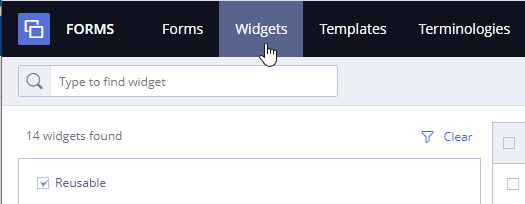
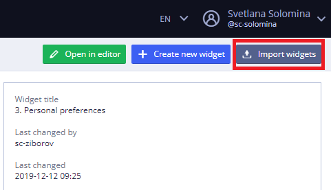
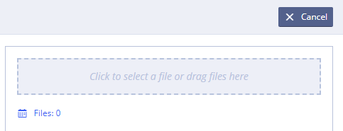
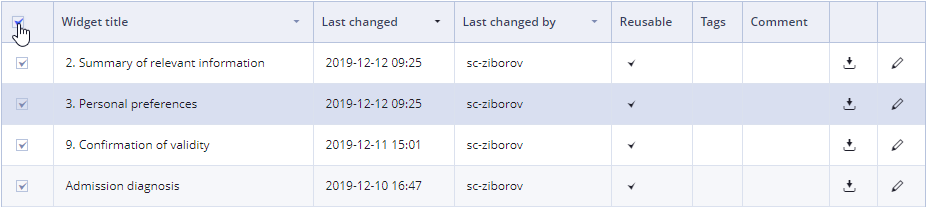
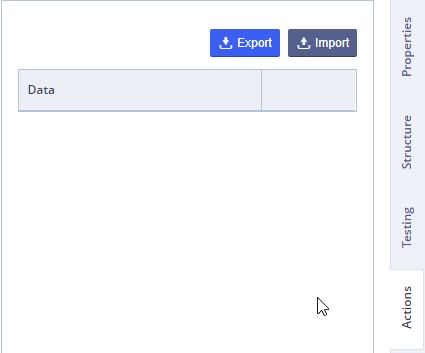

# Widget export and import

To import widget from a file:

* Log in and go to **Widgets**

* Click on 

* Click the drop area to select a file or drag files here

To export your widget\(s\):

* Log in and go to **Widgets**.

* Select one or more widgets in the list by using a checkbox next to the widget name.

          Use upper checkbox to select all widgets from the list.

* Click  

 The selected widgets will be exported from your account and downloaded to the default folder on your local drive.

Also user can Import\Export widget in editing mode by using corresponding buttons on the Actions tab:

