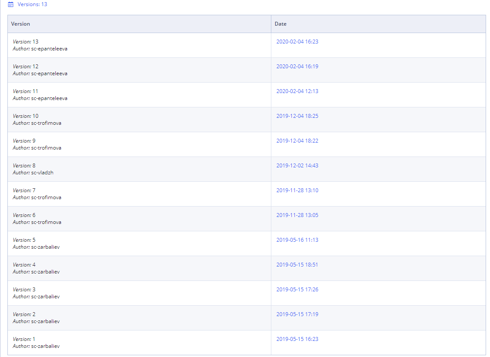

# Widget version control

Each widget has its version. User can see the version of the widget in the [Widget description](https://app.gitbook.com/pages/createpage.action?spaceKey=EHR\&title=Widget+list\&linkCreation=true\&fromPageId=34832677).

The version control table (see example below) updated each time a change is made to the component.

It details:

* The version number;
* The person making the change;
* The date of the change. &#x20;

By clicking on date of the change User can open the selected version in Editor.

